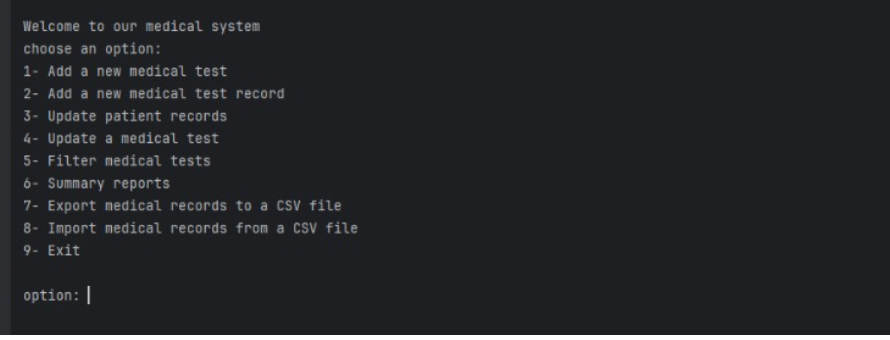

# Medical System Data Organizer (Shell Script)  

## **Project Description**  

The **Medical System Data Organizer** is a Shell Script-based system designed to manage **medical test records** and **patient data** efficiently. It allows users to add, update, filter, and export/import medical records using simple command-line operations.  

## **Features**  

✔ **Add a New Medical Test** – Create and store new medical test types.  
✔ **Add a New Medical Test Record** – Assign a test to a patient and store results.  
✔ **Update Patient Records** – Modify existing patient details or test results.  
✔ **Update a Medical Test** – Edit information about a specific medical test.  
✔ **Filter Medical Tests** – Search and filter tests based on user criteria.  
✔ **Generate Summary Reports** – Display reports of patient test records.  
✔ **Export Medical Records to CSV** – Save medical data to a CSV file for external use.  
✔ **Import Medical Records from CSV** – Load records from an existing CSV file.  

## Example Usage

To run the program, provide the input files attached and Run the main.sh file :

 

## Contact

For any inquiries, reach out via:

- Email: [miar.taweel04@gmail.com](mailto\:miar.taweel04@gmail.com)
- GitHub: [miarTaweel](https://github.com/miarTaweel)
